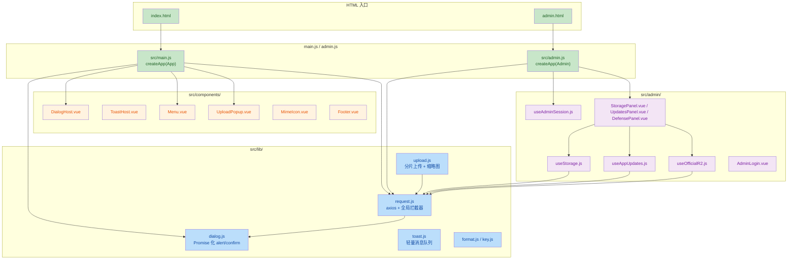
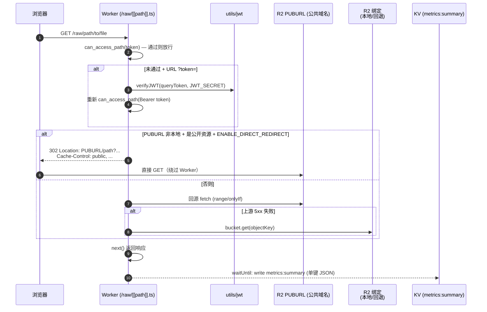
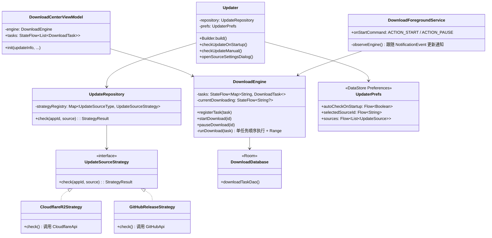

我已经对全部 149 个改动文件进行了详细分析。现在生成完整的代码评审报告。


<markdown_report>
## 1. 高层级摘要 (TL;DR)

*   **影响等级**：🔴 **高** — 本次提交是一次**跨技术栈全面重构**，涉及前端构建系统、后端 Functions、Android 升级框架三大模块。
*   **核心改动**：
    1.  **前端工程化**：彻底告别浏览器内 `vue3-sfc-loader` 运行时编译，全面迁移到 **Vite + ESM** 标准构建链，重组 `src/` 模块化目录。
    2.  **Android 升级库全面重写**：从老的 OkHttp + Java Serializable + SharedPreferences，重构为 **Compose + Coroutines/Flow + Room + DataStore + Retrofit + Strategy 模式** 的现代化架构，并将工程从单 module 拆分为 `:updater` (library) + `:demo` (host app)。
    3.  **后端 Functions 增强**：指标存储从 7 个独立 KV 键合并为单键 `metrics:summary`；`/raw/` 文件下载支持 302 直跳 R2 公共域名、URL Query 携带 JWT、本地开发回退等场景。
*   **典型不兼容点**：移除了 `assets/` 旧目录、`admin.css` 旧版式、移除了 `packages` 包构建方式（`wrangler pages dev` 改用 `vite` + `wrangler pages dev dist`），需重新部署。

---

## 2. 可视化总览 (代码与逻辑地图)

### 2.1 前端：浏览器运行时 → Vite 构建链



### 2.2 后端：Cloudflare Functions 下载链路（含 302 直跳）



### 2.3 Android Updater：新架构（Strategy + Repository + DownloadEngine）



---

## 3. 详细改动分析

### 3.1 📦 前端工程：构建系统迁移（Vite 化）

| 维度 | 旧实现 | 新实现 |
| --- | --- | --- |
| 入口方式 | 浏览器内 `vue3-sfc-loader` 运行时编译 | Vite 构建为 ESM，`/src/main.js`/`/src/admin.js` 双入口 |
| Vue 引入 | `<script src="cdn.../vue.global.min.js">` | `npm` 依赖 `vue@^3.4.38`、`axios@^0.27.2` |
| 构建脚本 | 仅 `wrangler pages dev .` | `dev`/`build`/`preview`/`pages:dev`/`pages:dev:build` 五种 |
| HTML 风格 | 内嵌大段 `<script>` 启动代码 | 极薄模板，仅 `<script type="module" src=...>` |
| 静态资源缓存 | 无统一策略 | `public/_headers` 精细化分层（`/assets/*.js` 一年，`/index.html` 零） |

**关键文件**：
*   `package.json`：移除 `vue3-sfc-loader`，新增 `vite`/`@vitejs/plugin-vue`，声明 `"type": "module"`
*   `vite.config.js`（新）：双入口 `index.html` + `admin.html`，手动 `manualChunks: { vendor: ["vue", "axios"] }`，开发期 `/api` + `/raw` 代理到 `BACKEND_TARGET`
*   `index.html`、`admin.html`（均简化）：删除 `vue3-sfc-loader` 的 `loadModule/getFile/addStyle` 模板
*   `.gitignore`：新增 `dist/`、`.wrangler/`、`backup/` 等

> ⚠️ **破坏性变更**：原 `assets/` 目录下 CDN 风格的运行时模块全部废弃；新版必须经 `npm run build` 后再上传 `dist/`。

### 3.2 🧱 前端：共享库 `src/lib/`

| 文件 | 关键改动 |
| --- | --- |
| `request.js` | `axios.create()` + 请求拦截器自动注入 `Authorization: Bearer ${token}`（读取 localStorage/sessionStorage）。响应拦截器统一处理 **401/403**：仅在非登录 URL 时清理 token 并 `dispatchEvent('flaredrive:unauthorized')`。**额外 hook `window.fetch`** 同源请求也注入 token，全局只挂一次（`window.__flaredriveFetchPatched`）。|
| `dialog.js` | `alertDialog/confirmDialog/promptDialog` 全部 Promise 化，统一通过响应式 `dialogState` 由 `<DialogHost>` 渲染。|
| `toast.js` | 上限 3 条的轻量 toast，4 种类型 + 自动 dismiss。|
| `upload.js` | `multipartUpload(key, file)`：100MB 分片（保持与原 API 兼容），通过 onUploadProgress 回调累积 `loaded/total`。|
| `key.js` | 新增 `encodeKey/displayName/isFolderKey`，统一 `FOLDER_PLACEHOLDER = '_$folder$'`。|
| `format.js` | `formatSize()` 自带单位换算。|

### 3.3 🧩 前端：组件层 `src/components/`、`src/admin/`

| 组件 | 作用 |
| --- | --- |
| `DialogHost.vue` | 渲染 `dialog.js` 的响应式状态，Escape 关闭 / Enter 确认 / prompt 自动 focus。 |
| `ToastHost.vue` | 顶部中部三层式 toast，自动定时 dismiss，点击即关。 |
| `Menu.vue` | 通过 `Teleport to="body"` 弹出菜单，`reposition()` 监听 resize/scroll 自动重定位。 |
| `UploadPopup.vue` | 四个按钮：拍照 / 图视频 / 其他文件 / 新建文件夹。 |
| `MimeIcon.vue` | 通过 contentType 选择不同 SVG path，已含图片缩略图优先。 |
| `App.vue` (~2531 行) | 主网盘页：拖拽、右键菜单、上传、FAB、搜索面板、存储容量卡片。 |
| `AdminLogin.vue` | 全屏独立鉴权页。 |
| `UpdatesPanel.vue` | App 多包发布编辑器（含 Markdown 内嵌渲染、APK 拖拽自动取包信息）。 |
| `StoragePanel.vue` | S3 操作指标 + 存储用量 + 官方 R2 GraphQL 拉取按钮。 |
| `DefensePanel.vue` | WAF/Edge Cache 防御建议 + 30 条审计流水表。 |

> 💡 **架构亮点**：Admin 模块用 **Composables 模式**（`useAdminSession/useStorage/useOfficialR2/useAppUpdates`）把响应式 `state` 作为单一来源，避免旧版 props 层层透传。

### 3.4 ☁️ 后端 Functions：协议优化与指标合并

#### 3.4.1 `functions/api/storage/usage.ts`

*   把 7 个 `kv.get(...)` 替换为单行 `toKvStats(await readMetrics(context.env.KV))`，DRY 显著改善。
*   `readMetrics` 优先读 `metrics:summary` 单键 JSON；不存在时自动 fallback 到旧的 7 键格式（`readLegacyMetrics`），**平滑兼容旧 KV 数据**。

#### 3.4.2 `functions/api/write/items/[[path]].ts`

| 改动 | 说明 |
| --- | --- |
| `decodeURIComponent` 拷贝源 | 修正前端 `encodeURIComponent` 后塞进 HTTP header（ASCII only）时的取值还原（`x-amz-copy-source!` 非空断言） |
| `httpMetadata.contentType` | `bucket.put` 现在带上请求 `content-type`，**下载时浏览器能正确识别文件类型**（之前默认二进制） |
| DELETE 改回 200 + JSON | 解决部分开发代理栈对 204 keep-alive 的 `Network Error` 竞态 |

#### 3.4.3 `functions/raw/[[path]].ts`（最复杂的一处）

*   **三层鉴权 fallback**：`can_access_path` → 若失败用 URL `?token=` 二次鉴权（方便 `<a>` / `window.open` 场景）→ 仍失败 `401`
*   **302 直跳 R2 公共域**：`isPublicAccessible(env, path)` 判断（缩略图 / `update/` / `GUEST` / `PUBLIC_PATHS` / 通配符 `*`），且 `PUBURL` 非 localhost → 302 + `Location: PUBURL/path` + `Cache-Control`
*   **本地开发友好**：`isLocalPub` 检测 `localhost/127.0.0.1/0.0.0.0/::1`，跳过 302，回退到 R2 绑定
*   **下游 query 清洗**：从 `urlObj.search` 删除 `token` 后再传给上游，避免泄漏
*   **R2 对象 key decode**：`bucket.get(objectKey)` 传入解码后的原始字符串，避免路径编码不一致导致 404
*   **企业级回退**：先尝试 PUBURL fetch，`upstream.status >= 500` 或异常时回退到 `bucket.get` 直读，断点续传保留
*   **新增 Chrome DevTools 友好**：`/.well-known/appspecific/com.chrome.devtools.json` 返回空 `{}` 200，消日志噪音

### 3.5 🤖 Android Updater：完整重写

#### 3.5.1 新 Gradle 工程结构

```
updater/
├─ settings.gradle.kts          # include :updater + :demo
├─ build.gradle.kts             # 根 plugins false 应用
├─ gradle/libs.versions.toml    # ★ 版本目录集中管理（AGP 8.5 / Kotlin 2.0.21 / compose-bom 2024.10）
├─ updater/                     # ← :updater Android Library
│  ├─ build.gradle.kts          # implementation + Room KSP + Retrofit + DataStore
│  └─ src/main/...
└─ demo/                        # ← :demo Android Application（演示宿主）
   └─ src/main/java/.../MainActivity.kt
```

**关键依赖升级**：

| 类别 | 旧 | 新 |
| --- | --- | --- |
| 语言 | Java 风格 + `Serializable` | Kotlin 2.0.21 + `@kotlinx.serialization.Serializable` |
| 异步 | Handler + Callback | Coroutines + Flow + StateFlow |
| 网络 | 自建 `OkHttpClient` | Retrofit 2.11 + kotlinx-serialization Converter |
| 持久化 | SharedPreferences (`UpdaterConfigManager`) | DataStore Preferences (`UpdaterPrefs`) + Room (`DownloadDatabase`) |
| UI | AlertDialog / XML | Jetpack Compose Material3 |
| 架构 | 单文件 Updater 一锅端 | Strategy + Repository + MVVM + Flow |

#### 3.5.2 核心模块清单

| 包 | 文件 | 职责 |
| --- | --- | --- |
| `com.updater` | `Updater.kt` | **Facade 入口**，`Builder` 构造，单例 `Updater.instance`。公开 `checkUpdateOnStartup/checkUpdateManual/setAutoCheckEnabled/openSourceSettingsDialog` 等 |
| `data` | `UpdateRepository.kt` | 策略分发表（按 `UpdateSourceType` 路由） |
| `data.source` | `UpdateSourceStrategy.kt` | `fun interface` + `sealed class StrategyResult { Success / NoUpdate / Error }` |
| `data.source` | `CloudflareR2Strategy.kt` | 调 `CloudflareApi.checkUpdate(appId)`，把 DTO 喂 `UpdateMapper.fromCloudflare` |
| `data.source` | `GitHubReleaseStrategy.kt` | 调 GitHub `/repos/{owner}/{repo}/releases/latest`，遍历 `.apk` assets |
| `data.mapper` | `UpdateMapper.kt` | DTO ↔ 领域模型 `UpdateInfo/UpdatePackage` |
| `api` | `CloudflareApi.kt` / `GitHubApi.kt` | Retrofit 接口 + `Response<T>` + `@Serializable` DTO |
| `api.dto` | `CloudflareUpdateDto.kt` / `GitHubReleaseDto.kt` | 全 `@Serializable` data class |
| `persistence` | `UpdaterPrefs.kt` | DataStore Flow 暴露 `autoCheckOnStartup / selectedSourceId / sources` |
| `persistence.db` | `DownloadDatabase.kt` | Room 单例 |
| `persistence.db` | `DownloadTaskEntity.kt` / `DownloadTaskDao.kt` | Entity ↔ Domain 转换 |
| `download` | `DownloadEngine.kt` | **核心状态机**：单任务顺序下载 + HTTP Range 断点续传 + Room 持久化进度 + 暴露 `StateFlow` |
| `download` | `DownloadForegroundService.kt` | 仅做"保活 + 通知栏"，跟随 `DownloadEngine.notificationEvents` 自动更新进度 |
| `install` | `ApkInstaller.kt` | Android 8+ 检查 `REQUEST_INSTALL_PACKAGES`，FileProvider 启动 ACTION_VIEW |
| `model` | `UpdateSource.kt` | `UpdateSourceType { CLOUDFLARE_R2, GITHUB_RELEASES, CUSTOM }` |
| `model` | `DownloadTask.kt` | 领域模型 + `DownloadStatus { PENDING/DOWNLOADING/PAUSED/COMPLETED/FAILED }` 枚举 |
| `ui` | `ThemeConfig.kt` | `UpdaterThemeConfig(主色/跟随系统深色/DynamicColor/Typography/ColorScheme)` + `UpdaterStateColors` + `CompositionLocal` 注入 |
| `ui` | `UpdaterTheme.kt` | Material3 Theme，宿主可覆盖 `ColorScheme` |
| `ui` | `UpdateDialog.kt` | AlertDialog 包裹 `UpdateInfo` + `isForceUpdate` 控制不可关闭 |
| `ui` | `DownloadCenterActivity.kt` / `SourceSettingsActivity.kt` | Activity 入口 |
| `ui.viewmodel` | `DownloadCenterViewModel.kt` / `SourceSettingsViewModel.kt` | `StateFlow` 暴露状态 + 处理 UI 事件 |
| `ui.component` | `PackageCard.kt` / `SourceItem.kt` | 可复用 Composable 卡片 |
| `utils` | `Network.kt` | 单例 `OkHttpClient` + `Retrofit.create<T>` inline |
| `utils` | `VersionUtils.kt` | 解析 `versionCode=30` 或从语义版本 `0.4.3 → 403` |
| `utils` | `Misc.kt` | `FileUtils.md5/verifyMd5` + `UrlUtils.resolveDownloadUrl/urlMd5` |
| `utils` | `ToastUtils.kt` | 长度截断 Toast 工具 |

#### 3.5.3 AndroidManifest 与权限

*   `updater/src/main/AndroidManifest.xml`：类名 `ForegroundDownloadService` → `DownloadForegroundService`；`DownloadManagerActivity` → `DownloadCenterActivity`；新增 `SourceSettingsActivity`、`FileProvider`（`{applicationId}.updater.provider` 指向 `@xml/updater_file_paths`）
*   权限保持：`INTERNET / REQUEST_INSTALL_PACKAGES / FOREGROUND_SERVICE / FOREGROUND_SERVICE_DATA_SYNC / POST_NOTIFICATIONS`

#### 3.5.4 演示 Demo：`updater/demo/MainActivity.kt`

*   `ComponentActivity` + Compose，纯 SDK 入口演示：
    *   `setBaseHost("https://your-app.pages.dev")`
    *   `setThemeConfig(UpdaterThemeConfig())`
    *   `build()` 后可一键调用 `updater.checkUpdateManual(this)` 等接口
*   `themes.xml` 定义 `Theme.UpdaterDemo`

---

## 4. 影响 & 风险评估

### 4.1 ⚠️ 破坏性 / 不兼容变更

| 类型 | 旧 | 新 | 影响 |
| --- | --- | --- | --- |
| **构建产物路径** | 旧版 Cloudflare Pages 默认读取仓库根目录 | **必须**走 `npm run build` 产出 `dist/` 给 Pages | 不配 Build command 会页面空白（README 已强调） |
| **CDN 静态资源** | `/assets/main.mjs` + `/assets/App.vue` SFC Loader 路径 | 经过 Vite hash 化的 `dist/assets/*.js` + `src/components/*.vue` 直接打包 | **所有写死 `/assets/main.mjs` 的外链将 404** |
| **HTML 模板** | 内嵌 vue3-sfc-loader 启动代码 | 极简 `<script type="module">` | 第三方书签/iframe 嵌入需重新适配 |
| **Android 库 API（运行时兼容，编译期破坏）** | 同名同签的 `Updater.Builder` | 内部重写，`Updater.kt` 公有 API 未变 | 业务调用方零改动；但如果业务代码反射引用了 `com.updater.config.UpdaterConfigManager`、`com.updater.utils.ApkInstaller`（旧包名）等，需要改成新包路径 |
| **共享文件夹命名常量** | 散落多处 `'$folder$' / '_$folder$'` | 集中在 `key.js: FOLDER_PLACEHOLDER` | 旧 KV 上的真实 key 已固定历史值，不影响；但前端展示需统一 |
| **指标 KV 存储** | 7 个分散键 | 合并到 `metrics:summary` | 自动 fallback，但首次写入是单键；旧键过期后可手动清理 |

### 4.2 🐛 新增错误处理与边界场景

*   `request.js`：401 静默清理 `localStorage/sessionStorage` 中 `flaredrive_token`，但**对 `/api/login` 调用豁免**（避免登录失败时清掉刚验证的会话状态）。
*   `functions/raw`：当 `?token=` 与 `Authorization` header 都存在时优先 header；本地环境不启动 302 跳转以避免 `r2.dev` 域名。
*   `downloader`：恢复任务时检查 `COMPLETED/FAILED + 文件不存在 → 重置为 PENDING`，防止用户清除缓存后看到僵尸任务。

### 4.3 ✅ 测试建议

> 以下场景建议审阅/测试时重点验证：

| 模块 | 建议测试场景 |
| --- | --- |
| 前端 Vite 构建 | `npm run build` 是否生成 dist/、本地 `npm run dev` + `wrangler pages dev` 双进程无 CORS 冲突 |
| Composables 状态隔离 | 打开多个 Tab 后 `useStorage` 是否拿到独立缓存（`sessionStorage` 隔离） |
| 对话框 | Enter / Escape / 蒙层点击 / prompt 自动 focus |
| Toast | 连续触发 > 3 条时的循环队列与自动删除最旧 |
| 上传分片 | 100MB 边界正好整除、单文件大于 100MB 的多片拼接 |
| `/raw/` JWT in URL | `<a href="/raw/foo?token=xxx">` 复制粘贴在新 Tab 能打开；301 转 302 后浏览器跟随 |
| 302 直跳 | 公开目录下载不应该看到 Worker 的日志；本地 dev 模式不应该走 302 |
| Android 下载断点续传 | 中途 kill app → 重启后从 `downloadedBytes` 续传，结果 MD5 校验通过 |
| Android UI 主题 | `useDynamicColor=true` + Android 12+ 设备和 Material3 表现一致；`followSystemDark=false` 强制浅色 |
| Android 多包同步 | GitHub Release 包含多个 `.apk` assets 时下载中心应展示多张卡片 |
| 指标合并 | 旧 KV 残留 7 键数据时，`readMetrics` fallback 是否仍能正确读取 `recent_logs` |

### 4.4 📋 部署 / 运维 Checklist

*   [ ] Cloudflare Pages 把 Framework preset 改为 `None` / `Vite`
*   [ ] Build command 设为 `npm run build`，Build output 改为 `dist`
*   [ ] 绑定环境变量 `CF_ACCOUNT_ID` 与 `CF_API_TOKEN`（可选，用于官方 R2 指标面板）
*   [ ] KV 命名空间绑定变量名 `KV`（可选，但失去则无审计流水）
*   [ ] Android 演示模块从 `:updater:assembleRelease` 集成后，包名映射正确（`BUILD_TOOLS_VERSION` 等已集中在 `libs.versions.toml`）
*   [ ] README 的 `pages:dev` 流程指引本地开发生效（`wrangler pages dev dist --r2 BUCKET`）

---

> 📌 **总评**：本次重构在保持对外业务接口基本不变的前提下，对前后端与 Android 三个端都做了**架构级升级**。前端从"CDN 即开即用"升级为现代构建系统；Cloudflare Functions 强化了鉴权、缓存、性能；Android 端则从零搭建了一套符合 Jetpack 推荐的现代化更新框架（Compose + Coroutines + Flow + Room + DataStore）。最大的资产是 **`utils/metrics.ts`、`UpdateRepository Strategy` 模式、`DownloadEngine` 协程状态机** 三处抽象，显著改善了可观测性和可扩展性。